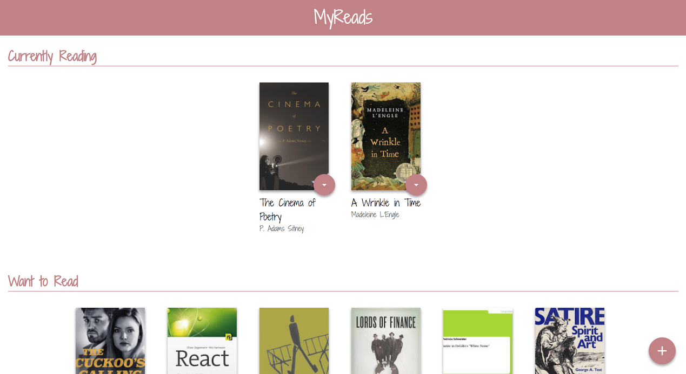
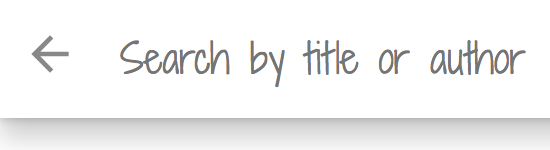
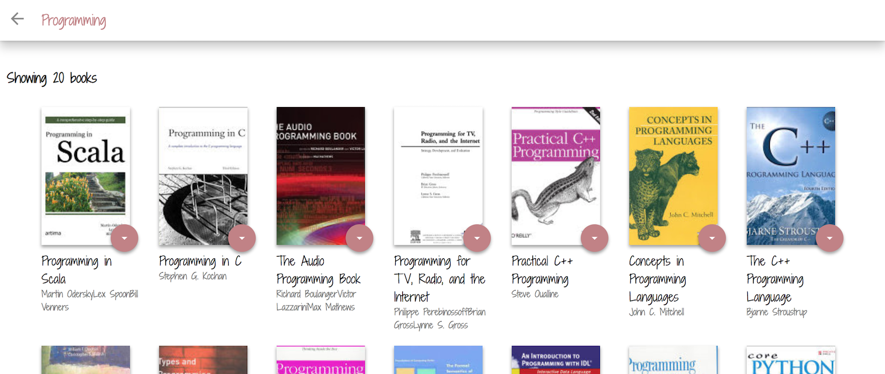

# Amy's MyReads Project

This is the assessment project for Udacity's React Fundamentals course.  The initial template given by Udacity as a tool to save time (by providing a static example of the CSS and HTML markup to be used) without any of the React code needed to complete the project.

Grading is based on Udacity's [MyReads Project Rubric](https://review.udacity.com/#!/rubrics/918/view), and [HTML](http://udacity.github.io/frontend-nanodegree-styleguide/index.html), [CSS](http://udacity.github.io/frontend-nanodegree-styleguide/css.html), [JavaScript](http://udacity.github.io/frontend-nanodegree-styleguide/javascript.html), [Git](https://udacity.github.io/git-styleguide/) Style Guides.

## How to Access this Project

This project was created and maintained using [Atom](https://atom.io/) Code Editor and submitted on Udacity's Workspace.  To get started with this project:

>Note: [Node.js](https://nodejs.org/en/) is required to run application.

* Clone repository into directory of choice: `git clone https://github.com/amyFEND/reactnd-project-myreads.git`
* Install all project dependencies with `npm install`
* Start the development server with `npm start`
>If browser does not automatically open with the application running, navigate to [http://localhost:3000](http://localhost:3000)

Or, if in the Udacity Workspace:
* Open a new terminal window within the Workspace
* Run `npm install`
* Run `npm start`
* Click  to run application

## How to Use MyReads App

  Books are sorted into three shelves: Currently Reading, Want to Read, and Read.

### Change Shelves
 * Click on 
 * Click the shelf of choice to move book to selected shelf *[Image of shelf options]*

### Add Books
  * Click on 
  * Enter text into search field 
    * Up to 20 books will show in search

  * Follow Change Shelves section (above) to add books to shelves

>Accepted terms are limited. See below for accepted search terms.

#### Accepted Search Terms

*Only* the following are accepted by the search function:
>'Android', 'Art', 'Artificial Intelligence', 'Astronomy', 'Austen',
>'Baseball', 'Basketball', 'Bhagat', 'Biography', 'Brief', 'Business',
>'Camus', 'Cervantes', 'Christie', 'Classics', 'Comics', 'Cook', 'Cricket', 'Cycling',
>'Desai', 'Design', 'Development', 'Digital Marketing', 'Drama', 'Drawing', 'Dumas',
>'Education', 'Everything', 'Fantasy', 'Film', 'Finance', 'First', 'Fitness', 'Football', 'Future',
>'Games', 'Gandhi', 'Homer', 'Horror', 'Hugo', 'Ibsen', 'Journey', 'Kafka', 'King',
>'Lahiri', 'Larsson', 'Learn', 'Literary Fiction', 'Make', 'Manage', 'Marquez', 'Money', 'Mystery',
>'Negotiate', 'Painting', 'Philosophy', 'Photography', 'Poetry', 'Production', 'Programming',
>'React', 'Redux', 'River', 'Robotics', 'Rowling', 'Satire',
>'Science Fiction', 'Shakespeare', 'Singh', 'Swimming', 'Tale', 'Thrun', 'Time', 'Tolstoy',
>'Travel', 'Ultimate', 'Virtual Reality', 'Web Development', 'iOS'

## Thank You to:

* [Maeva](https://www.youtube.com/channel/UCqKeTmQIyIXxSSKfFdfbnIg) for taking the time to create an amazing [step-by-step guide](https://www.youtube.com/watch?v=i6L2jLHV9j8&feature=youtu.be).
* [Michael](https://twitter.com/mjackson), [Ryan](https://twitter.com/ryanflorence), and [Tyler](https://twitter.com/tylermcginnis) for creating the Udacity course on [React](https://twitter.com/reactjs).

## Resources

* [React Documentation](https://reacttraining.com/react-router/web/guides/philosophy)
* [Create React App](https://github.com/facebookincubator/create-react-app)
* [GitHub Markdown Documentation](https://help.github.com/articles/getting-started-with-writing-and-formatting-on-github/)
* [Codeburst's Guide to GitHub Pages](https://codeburst.io/deploy-react-to-github-pages-to-create-an-amazing-website-42d8b09cd4d)
* [Shadows Into Light Font](https://fonts.google.com/specimen/Shadows+Into+Light?selection.family=Shadows+Into+Light)
* [Udacity Initial Project Template](https://github.com/udacity/reactnd-project-myreads-starter)
* [MyReads Project Rubric](https://review.udacity.com/#!/rubrics/918/view)
* Udacity's Style Guides:
  * [HTML](http://udacity.github.io/frontend-nanodegree-styleguide/index.html)
  * [CSS](http://udacity.github.io/frontend-nanodegree-styleguide/css.html)
  * [JavaScript](http://udacity.github.io/frontend-nanodegree-styleguide/javascript.html)
  * [Git](https://udacity.github.io/git-styleguide/)

## Contributing

This repository has been forked from Udacity's [Initial Project Template](https://github.com/udacity/reactnd-project-myreads-starter). Therefore, pull requests will most likely not be accepted.

For more details, check out [CONTRIBUTING.md](CONTRIBUTING.md) and the original README file ([PROJECTINSTRUCTIONS.md](PROJECTINSTRUCTIONS.md)).
